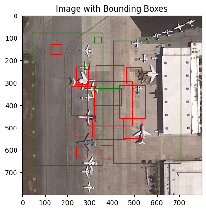

# Tiny Yolo 
This repo implements a lightweight version of YOLOv1 designed to be suitable for HE, which has the following architecture:
| Layer (type:depth-idx)        | Output Shape       | Param #    |
|-------------------------------|--------------------|------------|
| TinyYOLOv1                    | [1, 1470]          | --         |
| Conv2d: 1-1                   | [1, 8, 32, 32]     | 224        |
| SquareActivation: 1-2         | [1, 8, 32, 32]     | --         |
| BatchNorm2d: 1-3              | [1, 8, 32, 32]     | 16         |
| AvgPool2d: 1-4                | [1, 8, 16, 16]     | --         |
| Conv2d: 1-5                   | [1, 16, 8, 8]      | 1,168      |
| SquareActivation: 1-6         | [1, 16, 8, 8]      | --         |
| BatchNorm2d: 1-7              | [1, 16, 8, 8]      | 32         |
| AvgPool2d: 1-8                | [1, 16, 4, 4]      | --         |
| Flatten: 1-9                  | [1, 5000]          | --         |
| Linear: 1-10                  | [1, 2048]          | 526,336    |
| SquareActivation: 1-11        | [1, 2048]          | --         |
| Linear: 1-12                  | [1, 1470]          | 3,012,030  |

>Total params : 3,539,806

>Estimated Total Size (MB): 14.38

Here's a brief overview of how YOLOv1 works:

1.  **Image Division**: The input image is divided into a grid, typically, in YOLOv1, this is a 7x7 grid.
    
2.  **Bounding Box Prediction**: Each grid cell predicts multiple bounding boxes along with confidence scores. These bounding boxes represent the regions in the image where objects are likely to be found.
    
3.  **Class Prediction**: Along with each bounding box, class probabilities are predicted to determine the class of the object contained within the bounding box.
    
4.  **Single Forward Pass**: YOLOv1 predicts bounding boxes and class probabilities directly from the entire image using a single convolutional neural network. This makes YOLOv1 extremely fast compared to other object detection algorithms that rely on sliding windows or region proposals.
    
5.  **Non-Maximum Suppression**: After predictions are made, a post-processing step called non-maximum suppression is used to remove duplicate predictions and refine the final bounding box predictions.
    

Overall, YOLOv1 is known for its simplicity and efficiency, as it processes images globally and predicts bounding boxes and class probabilities simultaneously in a single forward pass of a neural network. However, it may struggle with detecting small objects and accurately localizing objects near the boundaries of grid cells.

## 1.	Data Loading & Preprocessing
First of all I defined a `DiorDataset` class which loads an image, resize to '(64,64)' and its corresponding labels given an index. It reads the image and label files and converts the labels into a suitable format for YOLO.

The labels are converted into a tensor of shape `(S, S, C + 5 * B)`. For each cell of the grid, it contains `C` probabilities for each class, `B` box confidence scores, and `4 * B` bounding box parameters. The bounding box parameters are normalized for the cell (i.e., they are in [0, 1] relative to the size of the cell).

The code assumes that the label files are in a specific format: 
> `[class label | x_center | y_center | width | height]`

## 2.	Yolo Loss
After loading dataset, the next step is to train the network using a loss function which detect bounding box and class probabilies at the same time. From original paper:
> YOLO predicts multiple bounding boxes per grid cell. At training time we only want one bounding box predictor to be responsible for each object. We assign one predictor to be “responsible” for predicting an object based on which prediction has the highest current IOU with the ground truth. 

It is composed by minimizing at the same time 2 types of MSE errors:

1.  **Classification Error**: YOLOv1 only penalizes classification errors for grid cells where objects are present. This means that if there's an object in a certain part of the image, the algorithm cares about correctly identifying what that object is. If there's no object in a grid cell, the algorithm doesn't penalize for getting the class wrong.
    
2.  **Bounding Box Error**: YOLOv1 only penalizes the bounding box predictions that are responsible for detecting the object. Let's say there's an object in a particular grid cell, and multiple bounding boxes are predicting where that object might be. The algorithm only penalizes the bounding box that has the highest overlap (Intersection over Union, IOU) with the actual object's bounding box. This ensures that only the most accurate bounding box prediction gets penalized for its deviation from the ground truth.

## 3. Convert predictions
In this part we care about extracting bounding boxes (bboxes) from the predictions of a given model. The model is set to evaluation mode using `model.eval()`. This is important because some models behave differently during training and evaluation (e.g., dropout layers).
1.  **Reshaping Predictions**: The predictions tensor is reshaped to have dimensions `[batch_size, 7, 7, C + 10]`, where `batch_size` is the size of the input batch, `C` is the number of classes, and `10` represents the bounding box coordinates and confidence scores.
2.  **Extracting Bounding Box Predictions**: Two sets of bounding boxes (`bboxes1` and `bboxes2`) are extracted from the reshaped predictions tensor. These bounding boxes represent different aspects of object localization. 
3. **Selecting the Best Box**: The box with the highest confidence score (`best_box`) is selected from the concatenated confidence scores.
4.  **Coordinates** of the best bounding boxes are calculated using the formulae:
    -   `x = 1 / S * (best_boxes[..., :1] + cell_indices)`
    -   `y = 1 / S * (best_boxes[..., 1:2] + cell_indices.permute(0, 2, 1, 3))`
    -   `w_y = 1 / S * best_boxes[..., 2:4]`
-   Here, `S` represents the size of the image split.

As result I have the following predictions with this shape: 

    [Predicted class indices | confidence scores | bounding box coordinates]

## 4. Results
This version obtain a mAP of 0.0022 on test set.

